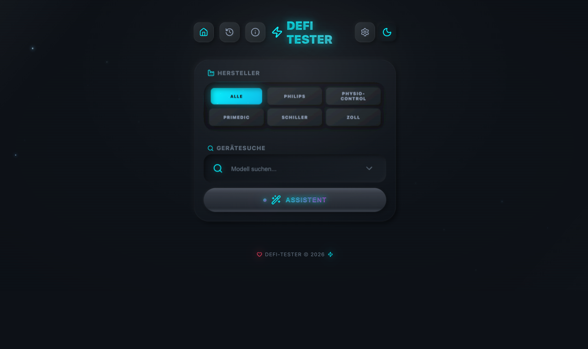
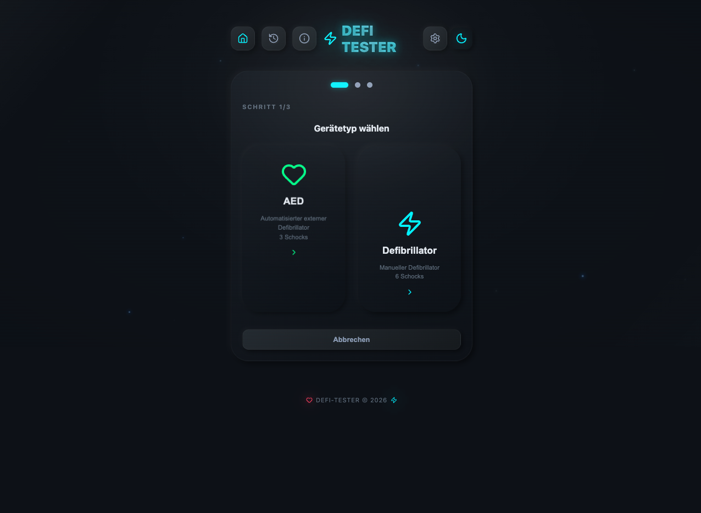
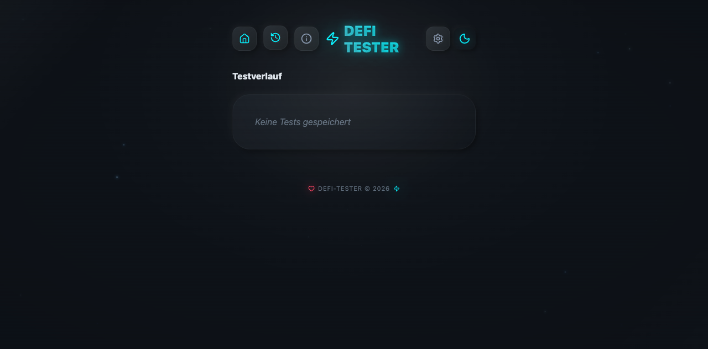

# ⚡ Defi Tester

**Ein Prototyp / Rumspielprojekt** — ein interaktiver Defibrillator-Tester für Medizintechniker.

> ⚠️ Dieses Projekt ist ein **Prototyp** und nicht für den produktiven Einsatz gedacht. Es dient als Experimentier- und Lernprojekt.

## Screenshots

### Startseite

### Assistent

### Testverlauf

## Features

- 🔍 Gerätesuche mit Filter nach Hersteller (Philips, Zoll, Physio-Control, Schiller, Primedic)
- ⚡ Geführter Test-Assistent für AEDs und manuelle Defibrillatoren
- 📋 Testverlauf mit lokaler Speicherung
- 🌙 Dark Mode
- 📱 PWA-fähig (installierbar auf iOS/Android)

## Tech Stack

- React 19 + TypeScript
- Vite 6
- Capacitor (Android)
- Deployed via Vercel

## Live Demo

👉 [defi-tester.vercel.app](https://defi-tester.vercel.app)
